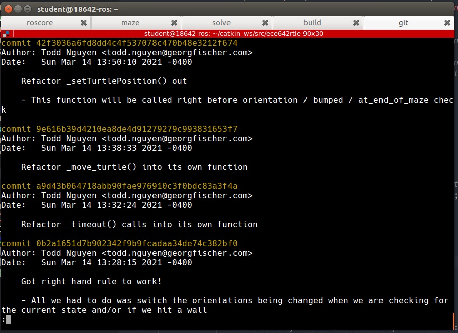

# Project 2 Write Up

|          |                |
| -------- | -------------- |
| Name     | Todd Nguyen    |
| AndrewID | noid           |
| Date     | March 14, 2021 |

## Q1

I used `git` as my version control. 

## Q2

I did not successfully modify the turtle algorithm after Step 4, as I spent too much time refactoring the left hand algorithm and trying to understand what it's doing.

## Q3

My `git` log:

```git
commit 42f3036a6fd8dd4c4f537078c470b48e3212f674
Author: Todd Nguyen <todd.nguyen@georgfischer.com>
Date:   Sun Mar 14 13:50:10 2021 -0400

    Refactor _setTurtlePosition() out

    - This function will be called right before orientation / bumped / at_end_of_maze check

commit 9e616b39d4210ea8de4d91279279c993831653f7
Author: Todd Nguyen <todd.nguyen@georgfischer.com>
Date:   Sun Mar 14 13:38:33 2021 -0400

    Refactor _move_turtle() into its own function

commit a9d43b064718abb90fae976910c3f0bdc83a3f4a
Author: Todd Nguyen <todd.nguyen@georgfischer.com>
Date:   Sun Mar 14 13:32:24 2021 -0400

    Refactor _timeout() calls into its own function

commit 0b2a1651d7b902342f9b9fcadaa34de74c382bf0
Author: Todd Nguyen <todd.nguyen@georgfischer.com>
Date:   Sun Mar 14 13:28:15 2021 -0400

    Got right hand rule to work!

    - All we had to do was switch the orientations being changed when we are checking for the current state and/or if we hit a wall

commit 13e07cfb66fad1f178087bc4f309f8b4b11e7365
Author: Todd Nguyen <todd.nguyen@georgfischer.com>
Date:   Sun Mar 14 00:38:28 2021 -0500

    Refactor the functions setting orientation and direction into its own function

    - Also refactor _w into _current_timeout

commit d0f73e73bd4c3243169af6a9649ce16d95c3fa2d
Author: Todd Nguyen <todd.nguyen@georgfischer.com>
Date:   Sun Mar 14 00:24:05 2021 -0500

    Rename _z to _has_this_orientation_been_traveled

commit 2c78a415e5ea6ad72ef53e17fe8ac600cc231f2c
Author: Todd Nguyen <todd.nguyen@georgfischer.com>
Date:   Sun Mar 14 00:21:08 2021 -0500

    .vscode .gitignore

commit 5154b823dbe7dffe6700b78e929bccd22123f0f5
Author: Todd Nguyen <todd.nguyen@georgfischer.com>
Date:   Sun Mar 14 00:20:51 2021 -0500

    Removed _mod variable as it is not used anywhere

commit 32738ff98bf711d952e60de242a9be2cc9691880
Author: Todd Nguyen <todd.nguyen@georgfischer.com>
Date:   Sun Mar 14 00:18:22 2021 -0500

    Use enum for orientation

    - Also use switch case instead of nested if / else if statements whenever possible.

commit 786451d9ad74895693fe2c34cf12cb704d36661a
Author: Todd Nguyen <todd.nguyen@georgfischer.com>
Date:   Sun Mar 14 00:03:10 2021 -0500

    Use enum class for State

commit 32e626ae26156ac95911d013b19b0e58bcf08493
Author: Todd Nguyen <todd.nguyen@georgfischer.com>
Date:   Sat Mar 13 23:49:51 2021 -0500

    Finish refactoring states

commit c4a5af4f144e6f3ed2cfc3279afb724247a5b889
Author: Todd Nguyen <todd.nguyen@georgfischer.com>
Date:   Sat Mar 13 23:42:02 2021 -0500

    Refactor variables: _maze_contains_wall and _is_end_of_maze

    - Also started work to refactor STATE

commit 3f1ea0e05e72301055e142baa5da9cc5af3c5156
Author: Todd Nguyen <todd.nguyen@georgfischer.com>
Date:   Sat Mar 13 23:23:56 2021 -0500

    Add names to orientations

commit 05f69bb3290aa5b040303e893f60aa9ed9636366
Author: Todd Nguyen <todd.nguyen@georgfischer.com>
Date:   Sat Mar 13 22:46:29 2021 -0500

    Prepend private variables with an "_"

commit 1dfc301f303f824b4411f7a0d8c4c9b933bab9ca
Author: Todd Nguyen <todd.nguyen@georgfischer.com>
Date:   Sat Mar 13 22:36:23 2021 -0500

    Add moveLeftHand() and moveRightHand() functions

commit 44581082cceda38c726072e18137663ebe413e79
Author: Todd Nguyen <todd.nguyen@georgfischer.com>
Date:   Sat Mar 13 22:30:45 2021 -0500

    Renamed files for successful compilation

commit b454de8a0ee71ecf00bbdd9cbaa006984e502381
Author: Todd Nguyen <todd.nguyen@georgfischer.com>
Date:   Sat Mar 13 22:06:59 2021 -0500

    Initial commit

commit a3a3e12a721dfbfa110a06e8ccd393798f29f2d6
Author: Todd Nguyen <todd.nguyen@georgfischer.com>
Date:   Sat Mar 13 22:05:27 2021 -0500

    Add .gitattributes
```

## Q4

I did successfully modified the algorithm after the second attempt. I was able to do this because the refactoring made it clear what the algorithm was doing. I spent about 30 minutes on Step 6.

## Q5

The only problem I encountered was that the variable names were unclear; however, that was intentional, so I think it's safer to say that I did not encounter any problems.
