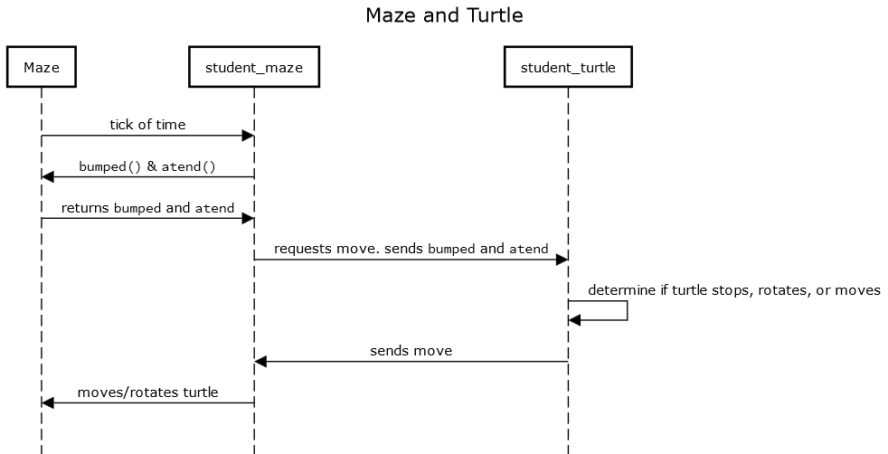
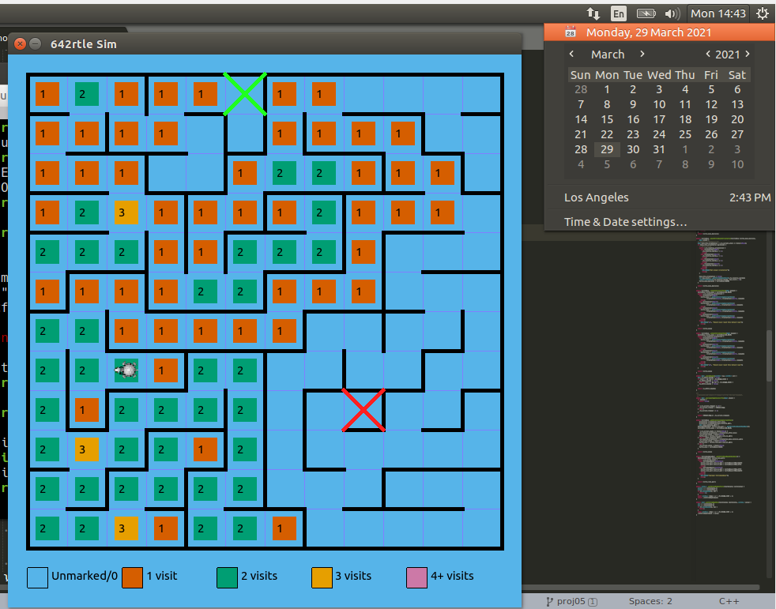
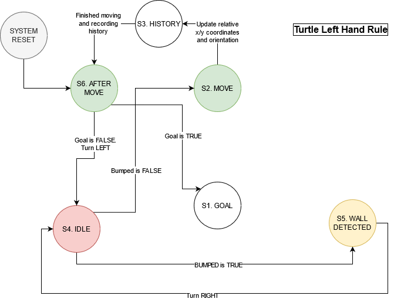

# Proj 05 Write Up

## Name

- Name: Todd Nguyen
- Andrew ID: noid
- Date: April 12, 2021

## Q1

`student_maze` sends `bumped` and `atend` information to `student_turtle`, then it requests a move from `student_turtle`. `student_turtle` takes `bumped` and `atend`, determines if it is a tick, and then returns a move to `student_maze`. The move can either be `NO_MOVE`, `MOVE`, `TURN_LEFT`, and `TURN_RIGHT`.

## Q2

## Q3

The turtle did NOT solve m2.maze maze. I think the reason the turtle was not able to solve the maze is because of the right-hand rule limitations. The right-hand rule states that the walls of the maze must either be connected to each other, or connected to the outer wall. There is an isolated wall near the bottom right near the target that is not connected to other walls nor the outer walls. Thus, the turtle will not be able to solve this maze using the right-hand rule (or the left-hand rule, for that matter).

## Q4

I would solve this by trying to implement Trémaux's algorithm, explained [here](https://en.wikipedia.org/wiki/Maze-solving_algorithm#Tr%C3%A9maux's_algorithm). Essentially, it is a form of depth-first search.

## Q5 - Sequence Diagrams

## Q6 - Statecharts

Right Hand Rule

Left Hand Rule

## Q7

I did get the code to do all three:

- Match the SD (Sequence Diagram)
- Match the statechart
- Solve at least the old maze
